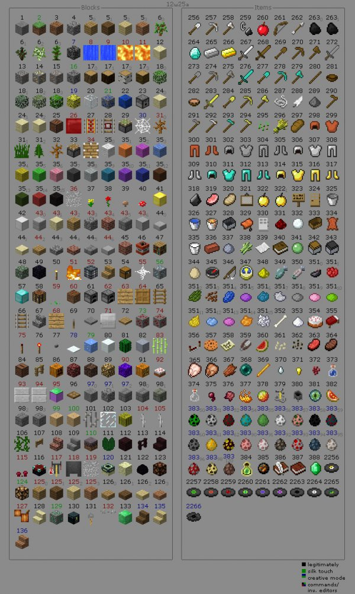
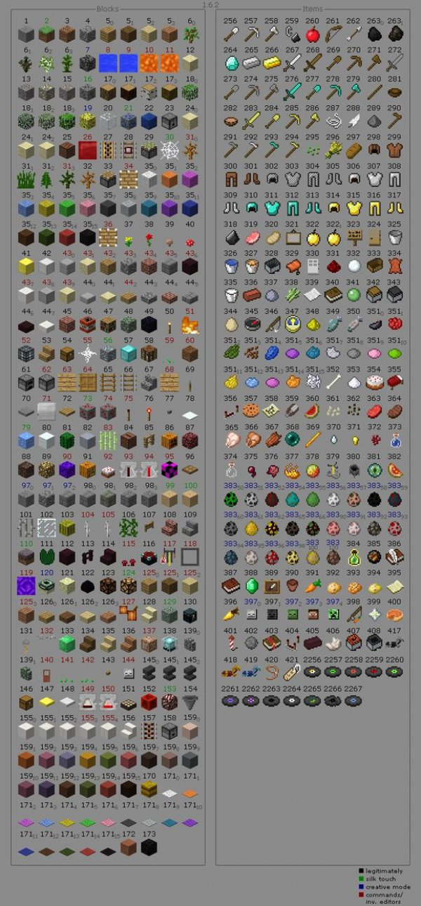

| 物品名称       | 物品英文ID           | 物品数字ID | 物品名称         | 物品英文ID          | 物品数字ID |
| -------------- | -------------------- | ---------- | ---------------- | ------------------- | ---------- |
| 石头           | STONE                | 1          | 草块             | GRASS               | 2          |
| 泥土           | DIRT                 | 3          | 圆石             | COBBLESTONE         | 4          |
| 橡木木板       | WOOD                 | 5          | 云杉木板         | WOOD:1              | 5:1        |
| 桦木木板       | WOOD:2               | 5:2        | 丛林木板         | WOOD:3              | 5:3        |
| 橡树树苗       | SAPLING              | 6          | 云杉树苗         | SAPLING:1           | 6:1        |
| 桦木树苗       | SAPLING:2            | 6:2        | 丛林树苗         | SAPLING:3           | 6:3        |
| 沙子           | SAND                 | 12         | 沙硕             | GRAVEL              | 13         |
| 金矿石         | GOLD_ORE             | 14         | 铁矿石           | IRON_ORE            | 15         |
| 煤矿石         | COAL_ORE             | 16         | 橡木             | LOG                 | 17         |
| 云杉木         | LOG:1                | 17:1       | 白桦木           | LOG:2               | 17:2       |
| 丛林木         | LOG:3                | 17:3       | 橡木树叶         | LEAVES              | 18         |
| 云杉树叶       | LEAVES:1             | 18:1       | 白桦树叶         | LEAVES:2            | 18:2       |
| 丛林树叶       | LEAVES:3             | 18:3       | 玻璃             | GLASS               | 20         |
| 青金石矿石     | LAPIS_ORE            | 21         | 青金石块         | LAPIS_BLOCK         | 22         |
| 发射器         | DISPENSER            | 23         | 沙石             | SANDSTONE           | 24         |
| 錾制沙石       | SANDSTONE:1          | 24:1       | 平滑沙石         | SANDSTONE:2         | 24:2       |
| 音符盒         | NOTE_BLOCK           | 25         | 动力铁轨         | POWERED_RAIL        | 27         |
| 探测铁轨       | DETECTOR_RAIL        | 28         | 粘性活塞         | PISTON_STICKY_BASE  | 29         |
| 灌木           | LONG_GRASS           | 31         | 枯死的灌木       | DEAD_BUSH           | 32         |
| 活塞           | PISTON_BASE          | 33         | 白色羊毛         | WOOL                | 35         |
| 橙色羊毛       | WOOL:1               | 35:1       | 红色羊毛         | WOOL:2              | 35:2       |
| 蓝色羊毛       | WOOL:3               | 35:3       | 黄色羊毛         | WOOL:4              | 35:4       |
| 灰色羊毛       | WOOL:5               | 35:5       | 粉色羊毛         | WOOL:6              | 35:6       |
| 深灰色羊毛     | WOOL:7               | 35:7       | 淡灰色羊毛       | WOOL:8              | 35:8       |
| 青色羊毛       | WOOL:9               | 35:9       | 紫色羊毛         | WOOL:10             | 35:10      |
| 蓝色羊毛       | WOOL:11              | 35:11      | 棕色羊毛         | WOOL:12             | 35:12      |
| 深绿色羊毛     | WOOL:13              | 35:13      | 红色羊毛         | WOOL:14             | 35:14      |
| 黑色羊毛       | WOOL:15              | 35:15      | 蒲公英           | YELLOW_FLOWER       | 37         |
| 玫瑰           | RED_ROSE             | 38         | 棕色蘑菇         | BROWN_MUSHROOM      | 39         |
| 红色蘑菇       | RED_MUSHROOM         | 40         | 金块             | GOLD_BLOCK          | 41         |
| 铁块           | IRON_BLOCK           | 42         | 石台阶           | STEP                | 44         |
| 沙石台阶       | STEP:1               | 44:1       | 木台阶           | STEP:2              | 44:2       |
| 圆石台阶       | STEP:3               | 44:3       | 砖台阶           | STEP:4              | 44:4       |
| 石砖台阶       | STEP:5               | 44:5       | 红砖             | BRICK               | 45         |
| TNT            | TNT                  | 46         | 书架             | BOOKSHELF           | 47         |
| 苔石           | MOSSY_COBBLESTONE    | 48         | 黑曜石           | OBSIDIAN            | 49         |
| 火把           | TORCH                | 50         | 橡木楼梯         | WOOD_STAIRS         | 53         |
| 箱子           | CHEST                | 54         | 钻石矿石         | DIAMOND_ORE         | 56         |
| 钻石块         | DIAMOND_BLOCK        | 57         | 工作台           | WORKBENCH           | 58         |
| 熔炉           | FURNACE              | 61         | 梯子             | LADDER              | 65         |
| 铁轨           | RAILS                | 66         | 石楼梯           | COBBLESTONE_STAIRS  | 67         |
| 拉杆           | LEVER                | 69         | 石压力板         | STONE_PLATE         | 70         |
| 木压力板       | WOOD_PLATE           | 72         | 红石矿石         | REDSTONE_ORE        | 73         |
| 红石火把       | REDSTONE_TORCH_ON    | 76         | 石按钮           | STONE_BUTTON        | 77         |
| 冰             | ICE                  | 79         | 雪               | SNOW_BLOCK          | 80         |
| 仙人掌         | CACTUS               | 81         | 粘土             | CLAY                | 82         |
| 唱片机         | JUKEBOX              | 84         | 栅栏             | FENCE               | 85         |
| 南瓜           | PUMPKIN              | 86         | 地狱岩           | NETHERRACK          | 87         |
| 灵魂沙         | SOUL_SAND            | 88         | 萤石             | GLOWSTONE           | 89         |
| 南瓜灯         | JACK_O_LANTERN       | 91         | 活板门           | TRAP_DOOR           | 96         |
| 石砖           | SMOOTH_BRICK         | 98         | 苔石砖           | SMOOTH_BRICK:1      | 98:1       |
| 裂石砖         | SMOOTH_BRICK:2       | 98:2       | 錾制石砖         | SMOOTH_BRICK:3      | 98:3       |
| 蘑菇           | HUGE_MUSHROOM_1      | 99         | 蘑菇             | HUGE_MUSHROOM_2     | 100        |
| 铁栅栏         | IRON_FENCE           | 101        | 玻璃板           | THIN_GLASS          | 102        |
| 西瓜           | MELON_BLOCK          | 103        | 藤蔓             | VINE                | 106        |
| 栅栏门         | FENCE_GATE           | 107        | 砖楼梯           | BRICK_STAIRS        | 108        |
| 石楼梯         | SMOOTH_STAIRS        | 109        | 菌丝             | MYCEL               | 110        |
| 睡莲           | WATER_LILY           | 111        | 地狱砖块         | NETHER_BRICK        | 112        |
| 地狱砖栅栏     | NETHER_FENCE         | 113        | 地狱砖楼梯       | NETHER_BRICK_STAIRS | 14         |
| 附魔台         | ENCHANTMENT_TABLE    | 116        | 末地石           | ENDER_STON          | 121        |
| 龙蛋           | DRAGON_EGG           | 122        | 红石灯           | REDSTONE_LAMP_OFF   | 123        |
| 橡木台阶       | WOOD_STEP            | 126        | 云杉台阶         | WOOD_STEP:1         | 126:1      |
| 桦木台阶       | WOOD_STEP:2          | 126:2      | 丛林台阶         | WOOD_STEP:3         | 126:3      |
| 沙石楼梯       | SANDSTONE_STAIRS     | 128        | 绿宝石矿石       | EMERALD_ORE         | 129        |
| 末影箱         | ENDER_CHEST          | 130        | 拌线钩           | TRIPWIRE_HOOK       | 131        |
| 绿宝石矿石     | EMERALD_BLOCK        | 133        | 云杉木楼梯       | SPRUCE_WOOD_STAIRS  | 134        |
| 桦木楼梯       | BIRCH_WOOD_STAIRS    | 135        | 丛林木楼梯       | JUNGLE_WOOD_STAIRS  | 136        |
| 铁铲子         | IRON_SPADE           | 256        | 铁镐             | IRON_PICKAXE        | 257        |
| 铁斧           | IRON_AXE             | 258        | 打火石           | FLINT_AND_STEEL     | 259        |
| 弓             | BOW                  | 261        | 铁剑             | IRON_SWORD          | 267        |
| 木剑           | WOOD_SWORD           | 268        | 木铲             | WOOD_SPADE          | 269        |
| 木镐           | WOOD_PICKAXE         | 270        | 木斧             | WOOD_AXE            | 271        |
| 石剑           | STONE_SWORD          | 272        | 石铲             | STONE_SPADE         | 273        |
| 石镐           | STONE_PICKAXE        | 274        | 石斧             | STONE_AXE           | 275        |
| 金剑           | GOLD_SWORD           | 283        | 金铲             | GOLD_SPADE          | 284        |
| 金镐           | GOLD_PICKAXE         | 285        | 金斧             | GOLD_AXE            | 286        |
| 木锄           | WOOD_HOE             | 290        | 石锄             | STONE_HOE           | 291        |
| 铁锄           | IRON_HOE             | 292        | 钻石锄           | DIAMOND_HOE         | 293        |
| 金锄           | GOLD_HOE             | 294        | 钻石剑           | DIAMOND_SWORD       | 276        |
| 钻石铲         | DIAMOND_SPADE        | 277        | 钻石镐           | DIAMOND_PICKAXE     | 278        |
| 钻石斧         | DIAMOND_AXE          | 279        | 桶               | BUCKET              | 325        |
| 水桶           | WATER_BUCKET         | 326        | 岩浆桶           | LAVA_BUCKET         | 327        |
| 指南针         | COMPASS              | 345        | 钓鱼竿           | FISHING_ROD         | 346        |
| 钟             | WATCH                | 347        | 空地图           | MAP                 | 358        |
| 剪刀           | SHEARS               | 359        | 火焰弹           | FIREBALL            | 385        |
| 苹果           | APPLE                | 260        | 碗               | BOWL                | 281        |
| 炖蘑菇         | MUSHROOM_SOUP        | 282        | 小麦种子         | SEEDS               | 295        |
| 小麦           | WHEAT                | 296        | 面包             | BREAD               | 297        |
| 生猪排         | PORK                 | 319        | 熟猪排           | GRILLED_PORK        | 320        |
| 金苹果         | GOLDEN_APPLE         | 322        | 牛奶             | MILK_BUCKET         | 335        |
| 生鱼           | RAW_FISH             | 349        | 熟鱼             | COOKED_FISH         | 350        |
| 糖             | SUGAR                | 353        | 蛋糕             | CAKE                | 354        |
| 曲奇           | COOKIE               | 357        | 西瓜             | MELON               | 360        |
| 南瓜种子       | PUMPKIN_SEEDS        | 361        | 西瓜种子         | MELON_SEEDS         | 362        |
| 生牛肉         | RAW_BEEF             | 363        | 牛排             | COOKED_BEEF         | 364        |
| 生鸡肉         | RAW_CHICKEN          | 365        | 熟鸡肉           | COOKED_CHICKEN      | 366        |
| 皮革帽子       | LEATHER_HELMET       | 298        | 皮革外衣         | LEATHER_CHESTPLATE  | 299        |
| 皮革裤子       | LEATHER_LEGGINGS     | 300        | 皮靴             | LEATHER_BOOTS       | 301        |
| 铁头盔         | IRON_HELMET          | 306        | 铁盔甲           | IRON_CHESTPLATE     | 307        |
| 铁护腿         | IRON_LEGGINGS        | 308        | 铁靴             | IRON_BOOTS          | 309        |
| 钻石头盔       | DIAMOND_HELMET       | 310        | 钻石胸甲         | DIAMOND_CHESTPLATE  | 311        |
| 钻石护腿       | DIAMOND_LEGGINGS     | 312        | 钻石靴           | DIAMOND_BOOTS       | 313        |
| 金头盔         | GOLD_HELMET          | 314        | 金护甲           | GOLD_CHESTPLATE     | 315        |
| 金护腿         | GOLD_LEGGINGS        | 316        | 金靴子           | GOLD_BOOTS          | 317        |
| 矿车           | MINECART             | 328        | 鞍               | SADDLE              | 329        |
| 船             | BOAT                 | 330        | 运输矿车         | STORAGE_MINECART    | 342        |
| 动力矿车       | POWERED_MINECART     | 343        | 煤炭             | COAL                | 263        |
| 木炭           | COAL:1               | 263:1      | 钻石             | DIAMOND             | 264        |
| 铁锭           | IRON_INGOT           | 265        | 金锭             | GOLD_INGOT          | 266        |
| 青金石         | NK_SACK:4            | 351:4      | 萤石粉           | GLOWSTONE_DUST      | 348        |
| 水瓶           | POTION               | 373        | 恶魂之泪         | GHAST_TEAR          | 370        |
| 金粒           | GOLD_NUGGET          | 371        | 地狱庞           | NETHER_STALK        | 372        |
| 玻璃瓶         | GLASS_BOTTLE         | 374        | 蜘蛛眼           | SPIDER_EYE          | 375        |
| 发酵蜘蛛眼     | FERMENTED_SPIDER_EYE | 376        | 烈焰粉           | BLAZE_POWDER        | 377        |
| 岩浆膏         | MAGMA_CREAM          | 378        | 末影之眼         | EYE_OF_ENDER        | 381        |
| 闪烁的西瓜     | SPECKLED_MELON       | 382        | 画               | PAINTING            | 321        |
| 告示牌         | SIGN                 | 323        | 木门             | WOOD_DOOR           | 324        |
| 铁门           | IRON_DOOR            | 330        | 红砖             | CLAY_BRICK          | 336        |
| 粘土           | CLAY_BALL            | 337        | 床               | BED                 | 335        |
| 酿造台         | BREWING_STAND_ITEM   | 379        | 炼药锅           | CAULDRON_ITEM       | 380        |
| 绿宝石         | EMERALD              | 388        | 墨囊             | INK_SACK            | 351        |
| 红色玫瑰       | INK_SACK:1           | 351:1      | 仙人掌绿         | INK_SACK:2          | 351:2      |
| 可可豆         | INK_SACK:3           | 351:3      | 青金石           | INK_SACK:4          | 351:4      |
| 紫色的染料     | INK_SACK:5           | 351:5      | 青色的染料       | INK_SACK:6          | 351:6      |
| 浅灰色染料     | INK_SACK:7           | 351:7      | 灰色的染料       | INK_SACK:8          | 351:8      |
| 粉红色染料     | INK_SACK:9           | 351:9      | 黄绿色染料       | INK_SACK:10         | 351:10     |
| 蒲公英黄       | INK_SACK:11          | 351:11     | 浅蓝色染料       | INK_SACK:12         | 351:12     |
| 品红染料       | INK_SACK:13          | 351:13     | 橙色染料         | INK_SACK:14         | 351:14     |
| 骨粉           | INK_SACK:15          | 351:15     | 唱片C418-13      | GOLD_RECORD         | 2256       |
| 唱片C418-cat   | GREEN_RECORD         | 2257       | 唱片C418-blocks  | RECORD_3            | 2258       |
| 唱片C418-chirp | RECORD_4             | 2259       | 唱片C418-far     | RECORD_5            | 2260       |
| 唱片C418-mall  | RECORD_6             | 2261       | 唱片C418-mellohi | RECORD_7            | 2262       |
| 唱片C418-satl  | RECORD_8             | 2263       | 唱片C418-strad   | RECORD_9            | 2264       |
| 唱片C418-ward  | RECORD_10            | 2265       | 唱片C418-11      | RECORD_11           | 2266       |
| 唱片C418-wait  | RECORD_12            | 2267       | 箭               | ARROW               | 262        |
| 木棍           | STICK                | 280        | 线               | STRING              | 287        |
| 羽毛           | FEATHER              | 288        | 火药             | SULPHUR             | 289        |
| 燧石           | FLINT                | 318        | 雪球             | SNOW_BALL           | 332        |
| 皮革           | LEATHER              | 334        | 甘蔗             | SUGAR_CANE          | 338        |
| 纸             | PAPER                | 339        | 书               | BOOK                | 340        |
| 粘液球         | SLIME_BALL           | 341        | 鸡蛋             | EGG                 | 344        |
| 骨头           | BONE                 | 352        | 腐肉             | ROTTEN_FLESH        | 367        |
| 末影珍珠       | ENDER_PEARL          | 368        | 火焰棒           | BLAZE_ROD           | 369        |
| 书与笔         | BOOK_AND_QUILL       | 386        | 成书             | WRITTEN_BOOK        | 387        |
| 红石           | REDSTONE             | 331        | 红石中继器       | DIODE               | 356        |
| 红石比较器     | COMPARATOR           | 404        |                  |                     |            |

附图一

